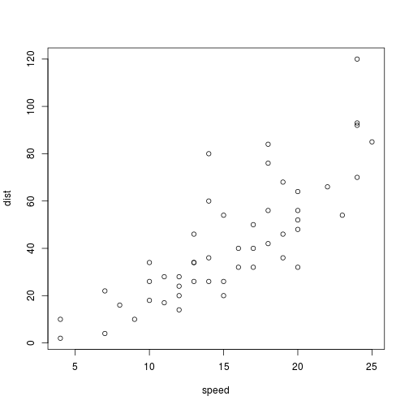

Coursera Data Science Capstone Project:  Word Prediction Algorithm/App Pitch
========================================================
author: T Fanselow
date: 26 June 2019
autosize: true

Word Prediction: Problem Overview
========================================================

Word prediction saves time.

See SwiftKey (product)

Overview of approach
========================================================

From a given corpus of text, word and n-gram frequencies word we analysed to build a next-word prediction model.

I chose to use a tree-based model for the task


```r
summary(cars)
```

```
     speed           dist       
 Min.   : 4.0   Min.   :  2.00  
 1st Qu.:12.0   1st Qu.: 26.00  
 Median :15.0   Median : 36.00  
 Mean   :15.4   Mean   : 42.98  
 3rd Qu.:19.0   3rd Qu.: 56.00  
 Max.   :25.0   Max.   :120.00  
```

Application Overview
========================================================
The prediction app is hosted on shinyapps.io:

https://tim-fan.shinyapps.io/word_prediction/


Try it out!

Type a few words in the text input box, and hit enter.  A prediction for the next word will be displayed.

The page also shows the matched sequence (n-gram) from the user input, and a view which words follow that sequence in the prediction tree.

<iframe width="560" height="315" src="https://tim-fan.shinyapps.io/word_prediction/" frameborder="0" allowfullscreen></iframe>

Application Features
========================================================
- Visualise tree
- No limit on n-gram length

===

Two Column Layout  
===
left: 30%
This slide has two columns

***


